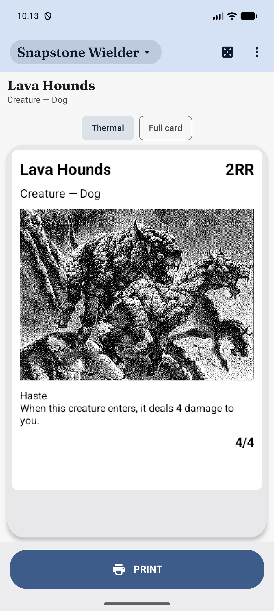
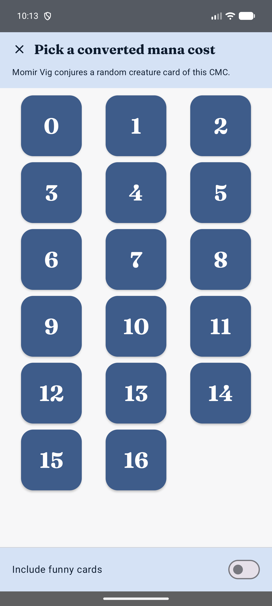

# SnapstonePrinter

An Android app that pulls a random (or named) *Magic: The Gathering* card from
[Scryfall](https://scryfall.com), renders it as a borderless, 384px-wide 1-bit dithered "proxy
slip", and hands it off to an external Bluetooth thermal printer app to print. Built to feed a
cheap receipt printer for casual kitchen-table Magic — conjure a card, print it, play it.

> [!IMPORTANT]
> **This app is almost entirely AI-written.** I'm not an Android developer — this whole project,
> architecture, implementation, debugging, and UI included, was built by directing
> [Claude Code](https://claude.com/claude-code) (Anthropic's coding agent) turn by turn, with me
> reviewing and steering rather than writing the code myself. Treat this as a vibe-coded personal
> project, not production software from an experienced team. If something looks over-engineered,
> under-engineered, or weird, that's why.

<p align="center">
  
  
</p>

## Get it

Grab a signed APK from the [Releases page](https://github.com/LeonardoDeQuirm/SnapstonePrinter/releases)
and sideload it — no Play Store listing. Or build it yourself (see [Building](#building) below).

## What it does

- **Snapstone Wielder mode** — taps Scryfall's `cards/random` for a random nonland card (or an
  exact card by name), dithers the art, and composes a print-ready slip: name, mana cost, type
  line, art, and rules text, laid out to match how it'll actually come out of the printer.
- **MomirVig mode** — a nod to the [Momir Basic](https://magic.wizards.com/en/formats/momir-basic)
  format: pick a converted mana cost and it conjures a random creature card of that cost, the way
  Momir Vig's ability does.
- **Double-faced cards handled properly** — true two-sided cards (transform, modal DFC) print as
  two sequential slips; split/flip/adventure cards (which share one piece of art) print both
  halves on the same slip instead of duplicating art across two prints.
- **Tone controls** — contrast/brightness sliders re-dither the already-downloaded art in memory,
  no network round-trip.
- **Session history** — reprint anything pulled this session without re-fetching it.
- **Remembers your printer app** — picks a target once from the share sheet, then skips straight
  to it on future prints (with a visible way to change or reset it).
- **Recovers from failed fetches** — a dropped connection or Scryfall hiccup shows a Retry button
  right on the error, no need to back out and start over.

## Why a thermal printer

384 dots wide at 200dpi (~48mm printable, on a standard ~58mm paper roll) is the printer's native
width — the whole rendering pipeline (auto-levels → Floyd-Steinberg dithering → 1-bit output)
targets that exact size, not "scale to fit." The app doesn't talk to the printer directly; it hands
a finished PNG to whatever Bluetooth printer app you already have installed via a standard share
intent, so it works with basically any cheap receipt-printer app. Sized for a
[Core Innovations CTP500](https://www.coreinnovationsinc.com/product/ctp500/) (200 DPI, confirmed
against its spec sheet) - real paper output hasn't been verified yet, only that the correct image
reaches a printer app.

## Requirements

- A modern Android phone (**minSdk 36** — this is deliberate, not an oversight).
- A Bluetooth thermal printer and an app for it that accepts a shared PNG (this project doesn't
  include a printer driver).
- No API key needed — Scryfall's API is public and keyless.

## Building

```
./gradlew assembleDebug
```

Standard Gradle/Android Studio project, single `:app` module. Kotlin + Jetpack Compose (Material
3), Retrofit + Moshi for the Scryfall client, Coil for image loading, Navigation3 for navigation.

`assembleRelease` additionally needs a signing keystore (`keystore.properties` at the repo root,
gitignored - not included) and produces an R8-shrunk, obfuscated build; without one it falls back
to an unsigned release build rather than failing. The signed APKs on the
[Releases page](https://github.com/LeonardoDeQuirm/SnapstonePrinter/releases) are built this way.

## Status

A hobby project under active, casual development — not published to the Play Store, no guarantees
about stability or fitness for anything in particular.
